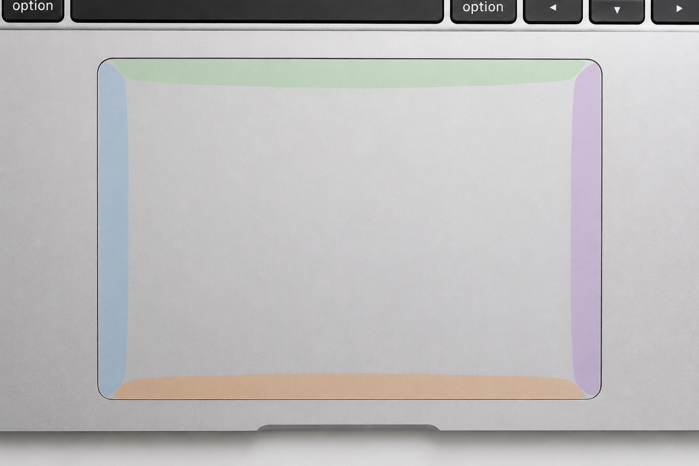

# Bezel

Bezel is a Linux daemon that provides customizable trackpad edge gestures.
It intercepts raw trackpad inputs via evdev and dispatches shell
commands based on directional swipes or taps along the edges (zones) of your trackpad.

<p align="center">
  
</p>

<br clear="right">

## Installation

Bezel is Linux-only (Wayland required).

### Prebuilt binary
```sh
curl -sSfL https://raw.githubusercontent.com/indra55/bezel/main/install.sh | bash
```
*(To update to a newer version, simply run this exact same command again. It will safely back up your old binary and seamlessly restart the service.)*

### From source
```sh
cargo install --git https://github.com/indra55/bezel
```

### Arch Linux

Normally we'd just tell you to `yay -S bezel`, but the AUR is currently experiencing a massive malware apocalypse. Someone adopted 1,500 orphaned packages and turned them into malware, so Arch had to disable new account registrations. We have our `PKGBUILD` ready to go, but until they put out the fire, you'll have to use the prebuilt binary or build from source like a normal person. Stay safe out there!

### NixOS
You can try out Bezel using this command:
```sh
nix run github:indra55/bezel
```

For a permanent installation, first add Bezel to your flake inputs:
```nix
{
  inputs = {
    # ... other inputs
    bezel = {
      url = "github:Indra55/bezel";
      inputs.nixpkgs.follows = "nixpkgs";
    };
  };

  # ... rest of your flake
}
```

Also make sure that you have `extraSpecialArgs = { inherit inputs; };` in your flake outputs.

Bezel provides a NixOS module. To enable it:
```nix
{ inputs, ... }: {
  imports = [
    inputs.bezel.nixosModules.default
  ];
}
```

You can now enable the Bezel service. This snippet will:
1. install the Bezel package on your system;
2. create and enable the Bezel service for all users;
3. configure udev rules.
**NOTE:** you'll still have to add yourself to the `input` and `uinput` groups
```nix
{ ... }: {
  services.bezel.enable = true;
}
```

If you prefer to enable Bezel per-user instead, you can do so using Home Manager.
```nix
{ inputs, ... }: {
  imports = [
    inputs.bezel.homeManagerModules.default
  ];

  services.bezel.enable = true;
}
```

**NOTE:** If you use the Home Manager module, you'll have to enable uinput separately in your NixOS config, as Home Manager doesn't have access to them:
```nix
{ ... }: {
  hardware.uinput.enable = true;
}
```

## Setup

Add yourself to the `input` group (required on all distros):
```sh
sudo usermod -aG input $USER
# reboot your computer after this
```

**NixOS Users:** Add `"input"` and `"uinput"` to your `users.users.<name>.extraGroups` instead of using `usermod`.

If you still get `Permission denied (os error 13)` after rebooting, you may need custom udev rules for your physical and virtual trackpads. Create `/etc/udev/rules.d/99-bezel.rules`:
```udev
SUBSYSTEM=="input", KERNEL=="event*", ENV{ID_INPUT_TOUCHPAD}=="1", GROUP="input", MODE="0640"
KERNEL=="uinput", MODE="0660", GROUP="input", OPTIONS+="static_node=uinput"
```
Then reload udev rules with `sudo udevadm control --reload-rules && sudo udevadm trigger`.

**NixOS Users:** set either `services.bezel.enable = true` or `hardware.uinput.enable = true`

### Configuration
Bezel looks for its configuration at `~/.config/bezel/config.toml`.

To define a gesture, specify the zone and direction, and the command to run:
```toml
[gestures.top.left]
action = "command"
cmd = "hyprctl dispatch workspace e-1"
```
*(See `config.toml.example` in this repo for a complete template).*

**NixOS Users:** After importing the Home Manager module you can also customize Bezel using the `services.bezel.config` option. See `config.nix.example` for a complete template.

### Autostart

> [!WARNING]  
> If you used the NixOS/HM module or `install.sh` script, Bezel is already running as a `systemd` service! **Do not** add these autostart commands, or you will run two instances simultaneously and they will crash.

Start Bezel when your Wayland compositor starts. **Void Linux / non-systemd** users should use this method instead of a background service. If `bezel` is not in your system `$PATH`, use the absolute path `~/.local/bin/bezel` (or `~/.cargo/bin/bezel` if built with cargo).

For **Hyprland** (`~/.config/hypr/hyprland.conf`):
```conf
exec-once = ~/.local/bin/bezel
```

For **Sway** (`~/.config/sway/config`):
```conf
exec ~/.local/bin/bezel
```

For **Niri** (`~/.config/niri/config.kdl`):
```conf
spawn-at-startup "~/.local/bin/bezel"
```

## Troubleshooting

If your trackpad stops responding, restart the service:
```sh
systemctl --user restart bezel.service
```
